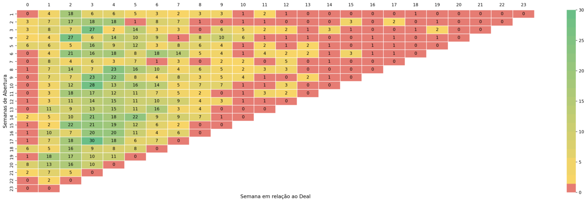

# coHort - Completude de Devolução

## Difinição de coHort e objetivos da análise

CoHort é uma técnica de análise de dados que visa a construção de grupos com base em caracteristicas comuns, por exemplo, em nossa análise de completude de instalação realizamos o agrupamento dos Deals com base na semana do ano em que ocorreu sua criação e em seguida refinamos este agrupamento com base no tempo necessário para sua conclusão (em semanas), após a realização deste agrupamentos realizamos a plotagem em um gráfico/tabela conforme o exemplo a seguir:

### Estruturação dos dados

Toda a estruturação da base de dados acontece através dos métodos contidos na classe **Estruturacao_dos_dados**, são eles:
- **obtencao_dos_dados**;
- **estruturacao_coHorts**;
- **tabela_resumida**.

#### Descição dos métodos

##### obtencao_dos_dados

Atualmente o relatório é extraido manualmente do Hubspot e importado no <a href="https://docs.google.com/spreadsheets/d/1Vdh6_eUNrQ59ij13kZoRESZJ0_ncc5su-fgmJchKiZ4/edit#gid=842775073">Google Sheets</a>, após a importação do relatório nesta planilha é realizada a leitura dele via o método <a href="https://script.google.com/macros/s/AKfycbwOFDUXCrRtMEQY4GXJ_jwp9x9Lp7NF3n06s9uU0NVF268iQo0jGvENvPBWHvWTalu4/exec">GET</a> e é realizada a consolidação dos deals e costrução do dataframe que servirá de base para a construção da ánalise de coHort.
Obs:  Os dados são classificado em **Concluido** e **Pendente** com base nas seguintes propriedades:
- O status do ticket deve ser: **Concluido** ou **Devolução Cancelada**;
- A soma de todos os dispositivos dos tickets classificados como **Concluido** deve ser igual a quantidade prevista para devolução do **Deal id** em questão.

#### estruturacao_coHorts

Devido a presença de valores nulos a composição do coHort ficava incompleta por este motivo foi criado a função de estruturação de coHort onde é realizada a construção da listagem contendo os valores referentes a cada semana.

#### tabela_resumida

Esta função cria uma tabela para visualização dos dados com a mesma base utilizada para construção dos coHorts.

#### Definicao_das_Views

Nesta classe se encontram definidos os métodos para construção das visualizações no streamlit, sendo elas:

- **configuracao_pagina_streamlit**;
- **autenticacao**;
- **constroi_coHort**;
- **propriedades_de_exibicao_coHort**;
- **filtra_por_classe**.

#### configuracao_pagina_streamlit

Está função configura a forma de exbição da tela e a permite exibição de gráficos pyPlot.

#### autenticacao

Está função foi desenvolvida afim de restringir o acesso a aplicação atavés da autenticação por login e senha, os usuarios estão salvos em um banco de dados postgres hospedado no Supabase.